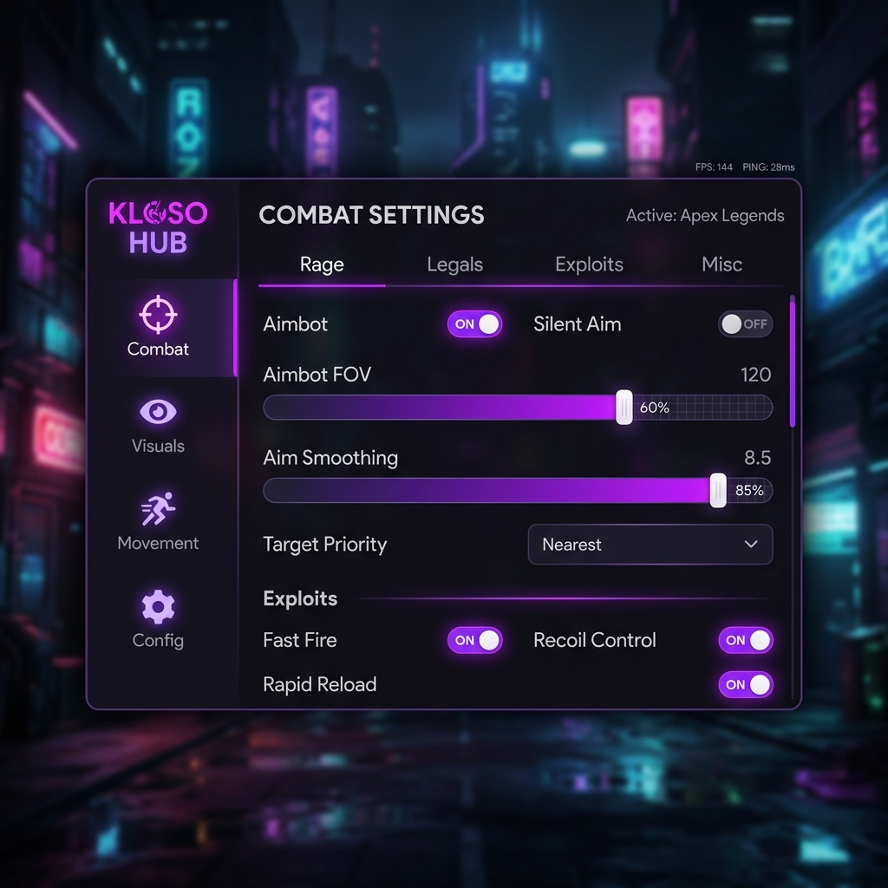

<p align="center">
  
</p>

<h1 align="center">🌌 Kloso Hub - Premium Multi-Game Suite</h1>

<p align="center">
  
  
  
</p>

<p align="center">
  <b>Kloso Hub</b> is a high-performance, keyless, and feature-rich script suite designed for a wide range of popular games on Roblox. Built with stability and user experience in mind, it provides a premium interface and powerful automation tools.
</p>

---

## 🚀 Execution

To use Kloso Hub, copy and paste the following script into your executor:

```lua
loadstring(game:HttpGet("https://raw.githubusercontent.com/AtaberkCelil/kloso-script/main/loader.lua"))()
```

---

## 🎮 Supported Games

Kloso Hub features dedicated, game-specific modules for the following titles:

- 🔫 **Rivals** (Silent Aim, Fly, Fullbright)
- 🏹 **Arsenal** (Hitbox, Crosshair, Fullbright)
- ⚔️ **The Strongest Battlegrounds** (Auto Combo, Auto Dodge, TP Behind)
- 🌪️ **Natural Disaster Survival** (Auto Survive, TP to Roof, Player ESP)
- 🍎 **Blox Fruits** (Auto Farm, Fruit ESP, Kill Aura)
- 🔪 **Murder Mystery 2** (Role ESP, Gun Grab, Murd Alert)
- 🏙️ **Da Hood** (Aim Lock, Target Strafe, Cash Aura)
- 🛏️ **Bedwars** (Reach, Killaura, Anti-Void)
- 🌐 **Universal Hub** (Fallback for any unsupported game)

---

## ✨ Key Features

<p align="center">
  
</p>

### 🛡️ Combat & Aiming
- **Silent Aim & Lock-On:** Advanced prediction logic for perfect accuracy.
- **Kill Aura:** Automatically damage nearby enemies or NPCs.
- **Hitbox Expander:** Make targets easier to hit without changing your aim.

### 👁️ Visuals (ESP)
- **High-Performance ESP:** Smooth boxes, names, health bars, and tracers using the Drawing API.
- **Item & Role Detection:** Specialized ESP for game-specific items likeMM2 roles or Blox Fruits.
- **Fullbright & X-Ray:** Never stay in the dark and see through any obstacle.

### 🏃 Movement
- **Premium Fly Mode:** Smooth, WASD-based flight with adjustable speed.
- **Speed & Jump Mods:** Fine-tune your character's physical properties.
- **Anti-Void:** Automatically save yourself from falling out of the map.

### ⚙️ Utility & Config
- **Config System:** Save and load your favorite settings per game.
- **Server Utilities:** Quick Server Hop, Rejoin, and Anti-AFK.
- **Keyless Interface:** No annoying linkvertise or keys required.

---

## 🛠️ Installation & Updates

1. Ensure you have a compatible executor.
2. Run the loadstring provided above.
3. The loader will automatically detect your game and inject the correct module.

> [!TIP]
> Use the **Config** tab within each script to save your settings so you don't have to re-configure them every time you join!

---

## ⚠️ Disclaimer

This project is for educational purposes only. Use it at your own risk. We are not responsible for any actions taken against your account by game developers.

---

<p align="center">
  Made with 💜 by AtaberkCelil
</p>
